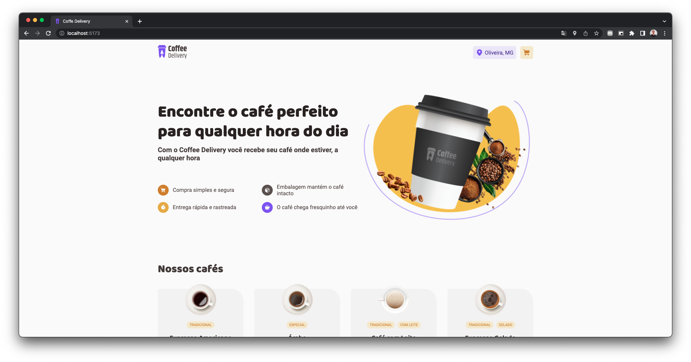
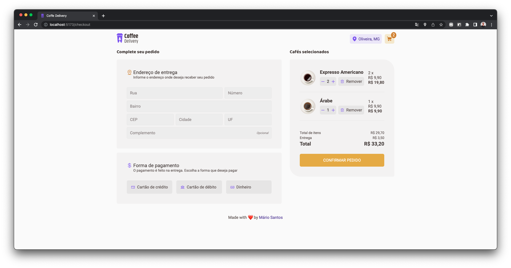

# Coffee Delivery

This project was built in **9hrs and 18mins** following the <a href="https://www.figma.com/file/5yT9ZzZmRQRS4yivGGB3pl/Coffee-Delivery/duplicate">mockup</a> created by <a href="https://github.com/rocketseat">Rocketseat</a>.

</img>
</img>

## About Project

This project is an simple ecommerce that the user can view and buy coffees.
The project was developed to finish an challenge steps of the course <a href="https://www.rocketseat.com.br/ignite">Ignite</a>. I started from zero, just following the <a href="https://www.figma.com/file/5yT9ZzZmRQRS4yivGGB3pl/Coffee-Delivery/duplicate">mockup</a> already created.

## Technologies

- reactJS
- viteJS
- styled-components
- immer
- superjson
- express
- react-router-DOM
- zod
- react-hook-form
- react-hot-toast
